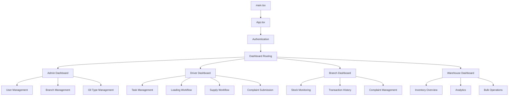
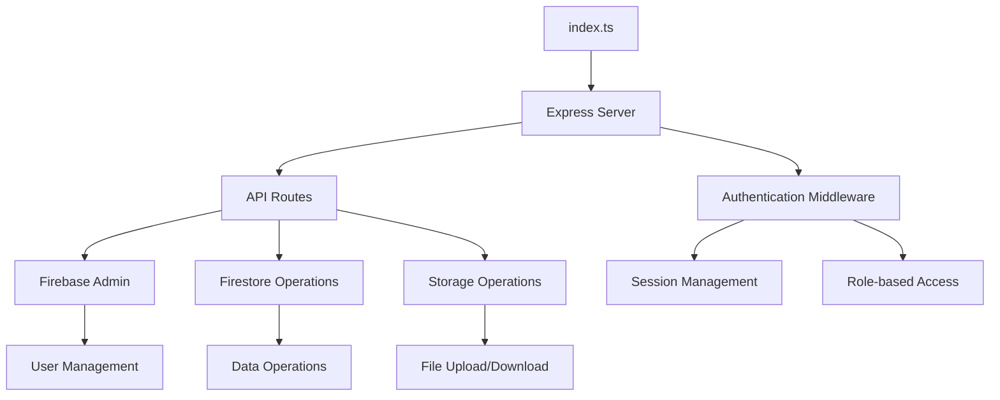

# OneDelivery Project Structure

This document provides a detailed overview of the OneDelivery project structure and architecture.

## 📁 Directory Structure

```
onedelivery/
├── 📂 client/                          # Frontend React Application
│   ├── 📂 src/
│   │   ├── 📂 components/              # Reusable UI Components
│   │   │   ├── 📂 ui/                  # shadcn/ui Base Components
│   │   │   │   ├── 📄 button.tsx
│   │   │   │   ├── 📄 card.tsx
│   │   │   │   ├── 📄 dialog.tsx
│   │   │   │   ├── 📄 form.tsx
│   │   │   │   ├── 📄 input.tsx
│   │   │   │   ├── 📄 select.tsx
│   │   │   │   ├── 📄 table.tsx
│   │   │   │   ├── 📄 tabs.tsx
│   │   │   │   └── 📄 toast.tsx
│   │   │   ├── 📄 camera-capture.tsx   # Camera/Photo Components
│   │   │   ├── 📄 complaint-form.tsx   # Complaint Management
│   │   │   ├── 📄 complaint-list.tsx
│   │   │   ├── 📄 loading-workflow.tsx # Loading Workflow Components
│   │   │   ├── 📄 supply-workflow.tsx  # Supply Workflow Components
│   │   │   ├── 📄 branch-selector.tsx  # Branch Selection
│   │   │   ├── 📄 oil-type-manager.tsx # Oil Type Management
│   │   │   ├── 📄 photo-gallery.tsx    # Photo Display/Management
│   │   │   ├── 📄 transaction-list.tsx # Transaction Components
│   │   │   └── 📄 user-management.tsx  # User Management Components
│   │   ├── 📂 pages/                   # Application Pages
│   │   │   ├── 📄 admin-dashboard.tsx  # Admin Dashboard & Management
│   │   │   ├── 📄 driver-dashboard.tsx # Driver Task Management
│   │   │   ├── 📄 branch-dashboard.tsx # Branch Operations
│   │   │   ├── 📄 warehouse-dashboard.tsx # Warehouse Management
│   │   │   ├── 📄 login.tsx           # Authentication
│   │   │   ├── 📄 complaints-page.tsx # Complaint Management
│   │   │   ├── 📄 transactions-page.tsx # Transaction History
│   │   │   ├── 📄 profile-page.tsx    # User Profile
│   │   │   └── 📄 not-found.tsx       # 404 Page
│   │   ├── 📂 hooks/                   # Custom React Hooks
│   │   │   ├── 📄 use-auth.tsx        # Authentication Hook
│   │   │   ├── 📄 use-firebase.tsx    # Firebase Operations
│   │   │   ├── 📄 use-camera.tsx      # Camera/Photo Hooks
│   │   │   ├── 📄 use-complaints.tsx  # Complaint Management
│   │   │   ├── 📄 use-transactions.tsx # Transaction Operations
│   │   │   └── 📄 use-toast.tsx       # Toast Notifications
│   │   ├── 📂 lib/                     # Utility Libraries
│   │   │   ├── 📄 firebase.ts         # Firebase Configuration
│   │   │   ├── 📄 utils.ts            # General Utilities
│   │   │   ├── 📄 queryClient.ts      # React Query Client
│   │   │   ├── 📄 validations.ts      # Zod Schemas
│   │   │   ├── 📄 photo-utils.ts      # Photo Processing
│   │   │   ├── 📄 csv-utils.ts        # CSV Import/Export
│   │   │   └── 📄 date-utils.ts       # Date Formatting
│   │   ├── 📂 utils/                   # Additional Utilities
│   │   │   ├── 📄 watermark.ts        # Photo Watermarking
│   │   │   ├── 📄 auth-utils.ts       # Authentication Helpers
│   │   │   └── 📄 storage-utils.ts    # Storage Operations
│   │   ├── 📄 App.tsx                 # Main App Component
│   │   ├── 📄 main.tsx                # Application Entry Point
│   │   ├── 📄 index.css               # Global Styles
│   │   └── 📄 test-db-connection.tsx  # Database Testing
│   ├── 📄 index.html                  # HTML Template
│   ├── 📄 apple-touch-icon.png        # PWA Icons
│   └── 📄 icon-192x192.png
│
├── 📂 server/                          # Backend Express Application
│   ├── 📄 index.ts                    # Server Entry Point
│   ├── 📄 routes.ts                   # API Routes
│   ├── 📄 firebase.ts                 # Firebase Client Config
│   ├── 📄 firebaseAdmin.ts            # Firebase Admin SDK
│   ├── 📄 db.ts                       # Database Configuration
│   ├── 📄 storage.ts                  # Storage Interface
│   ├── 📄 replitAuth.ts               # Replit Authentication
│   └── 📄 vite.ts                     # Vite Dev Server
│
├── 📂 shared/                          # Shared TypeScript Types
│   └── 📄 schema.ts                   # Database Schemas
│
├── 📂 scripts/                         # Deployment Scripts
│   ├── 📄 deploy-firebase.sh          # Firebase Deployment
│   ├── 📄 deploy-github.sh            # GitHub Pages Deployment
│   └── 📄 setup-firebase.sh           # Firebase Setup
│
├── 📂 docs/                            # Documentation
│   ├── 📄 DEPLOYMENT.md               # Deployment Guide
│   ├── 📄 PROJECT_STRUCTURE.md        # This File
│   └── 📄 API.md                      # API Documentation
│
├── 📂 dist/                            # Build Output
├── 📂 attached_assets/                 # Development Assets
│
├── 📄 README.md                       # Main Documentation
├── 📄 replit.md                       # Replit Project Info
├── 📄 .env.example                    # Environment Template
├── 📄 package.json                    # Dependencies & Scripts
├── 📄 tsconfig.json                   # TypeScript Configuration
├── 📄 vite.config.ts                  # Vite Configuration
├── 📄 tailwind.config.ts              # Tailwind CSS Config
├── 📄 components.json                 # shadcn/ui Configuration
├── 📄 drizzle.config.ts               # Database ORM Config
├── 📄 firebase.json                   # Firebase Configuration
├── 📄 firestore.rules                 # Database Security Rules
├── 📄 firestore.indexes.json          # Database Indexes
├── 📄 storage.rules                   # Storage Security Rules
└── 📄 manifest.json                   # PWA Manifest
```

## 🏗 Architecture Overview

### Frontend Architecture (React)



### Backend Architecture (Express)



## 🔧 Key Components

### Dashboard Components

#### Admin Dashboard (`admin-dashboard.tsx`)
- **Purpose**: Complete system management
- **Features**: User management, branch configuration, oil type management, system oversight
- **Key Components**: UserManagement, BranchManager, OilTypeManager, SystemStats

#### Driver Dashboard (`driver-dashboard.tsx`)
- **Purpose**: Driver task management and workflows
- **Features**: Task assignment, loading workflow, supply workflow, complaint submission
- **Key Components**: TaskManager, LoadingWorkflow, SupplyWorkflow, ComplaintForm

#### Branch Dashboard (`branch-dashboard.tsx`)
- **Purpose**: Branch-specific operations
- **Features**: Oil level monitoring, stock updates, local complaint management
- **Key Components**: StockMonitor, TransactionHistory, ComplaintList

#### Warehouse Dashboard (`warehouse-dashboard.tsx`)
- **Purpose**: Inventory and bulk operations
- **Features**: Tank tracking, analytics, bulk CSV operations, driver management
- **Key Components**: InventoryOverview, Analytics, BulkOperations, TankTracking

### Workflow Components

#### Loading Workflow (`loading-workflow.tsx`)
- **Purpose**: Manage oil loading from depot to trucks
- **Features**: Multi-driver sessions, photo evidence, meter readings
- **State Management**: useLoadingWorkflow hook
- **Key Features**: Session management, driver assignment, photo capture

#### Supply Workflow (`supply-workflow.tsx`)
- **Purpose**: Manage oil delivery from truck to branch tanks
- **Features**: Branch selection, tank updates, delivery confirmation
- **State Management**: useSupplyWorkflow hook
- **Key Features**: Tank level updates, delivery confirmation, photo evidence

### Utility Components

#### Camera Capture (`camera-capture.tsx`)
- **Purpose**: Handle photo capture and watermarking
- **Features**: Camera access, automatic watermarking, Firebase Storage upload
- **Dependencies**: Canvas API, Firebase Storage

#### Photo Gallery (`photo-gallery.tsx`)
- **Purpose**: Display and manage photos
- **Features**: Photo viewing, download, bulk operations
- **Dependencies**: Firebase Storage, JSZip for bulk downloads

## 🔄 Data Flow

### Authentication Flow
1. User logs in via Firebase Authentication
2. User data fetched from Firestore
3. Role-based dashboard routing
4. Session management with Express

### Workflow Data Flow
1. **Loading**: Depot → Truck (LoadingWorkflow)
2. **Supply**: Truck → Branch Tank (SupplyWorkflow)
3. **Tracking**: Real-time updates in Firestore
4. **Analytics**: Aggregated data in dashboards

### Photo Management Flow
1. Camera capture with automatic watermarking
2. Upload to Firebase Storage
3. Metadata stored in Firestore
4. Display in galleries and workflows

## 🎨 Styling Architecture

### Tailwind CSS Structure
- **Base styles**: `index.css`
- **Component styles**: Inline with Tailwind classes
- **Theme configuration**: `tailwind.config.ts`
- **Design system**: shadcn/ui components

### Component Library (shadcn/ui)
- **Base components**: Radix UI primitives
- **Styling**: Tailwind CSS with CSS variables
- **Customization**: `components.json` configuration
- **Theme support**: Light/dark mode ready

## 🗄 Database Structure

### Firestore Collections

```typescript
// Users Collection
interface User {
  uid: string;
  email: string;
  role: 'admin' | 'driver' | 'branch' | 'warehouse';
  displayName: string;
  active: boolean;
  branchIds: string[];
  createdAt: Timestamp;
}

// Branches Collection
interface Branch {
  id: string;
  name: string;
  address: string;
  contactNo: string;
  oilTanks: OilTank[];
  active: boolean;
  createdAt: Timestamp;
}

// Oil Types Collection
interface OilType {
  id: string;
  name: string;
  description: string;
  category: string;
  active: boolean;
}

// Transactions Collection
interface Transaction {
  id: string;
  type: 'loading' | 'supply' | 'delivery';
  driverId: string;
  branchId: string;
  oilTypeId: string;
  quantity: number;
  photos: string[];
  status: string;
  timestamp: Timestamp;
}
```

## 🔐 Security Architecture

### Authentication
- **Firebase Authentication**: Email/password with domain restrictions
- **Role-based Access**: Firestore rules based on user roles
- **Session Management**: Express sessions with PostgreSQL storage

### Authorization
- **Page-level**: Route protection based on user roles
- **Component-level**: Conditional rendering based on permissions
- **API-level**: Middleware validation for all routes

### Data Security
- **Firestore Rules**: Production-ready security rules
- **Storage Rules**: File access control
- **Environment Variables**: Secure configuration management

## 🚀 Performance Optimizations

### Frontend Optimizations
- **Code Splitting**: React.lazy for page components
- **React Query**: Efficient data caching and synchronization
- **Image Optimization**: Automatic resizing and compression
- **Bundle Optimization**: Tree shaking and dead code elimination

### Backend Optimizations
- **Database Indexes**: Optimized Firestore queries
- **Caching**: Express session caching
- **Connection Pooling**: PostgreSQL connection management

### Build Optimizations
- **Vite**: Fast development and optimized production builds
- **TypeScript**: Compile-time error checking
- **ESBuild**: Fast bundling for production

---

**For detailed API documentation, see [API.md](./API.md)**
**For deployment instructions, see [DEPLOYMENT.md](./DEPLOYMENT.md)**